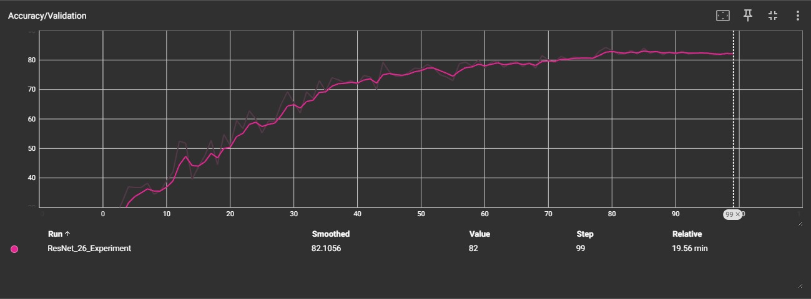
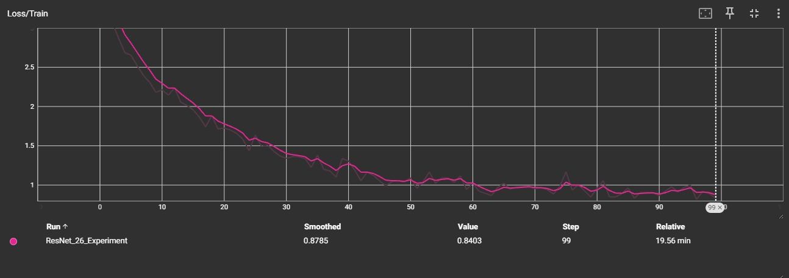
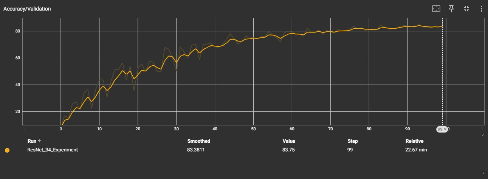
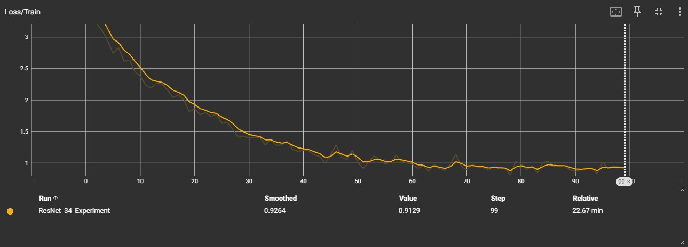
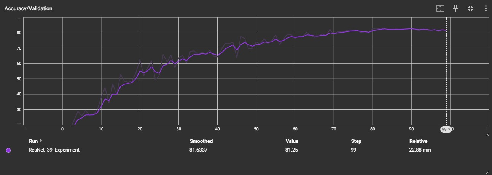
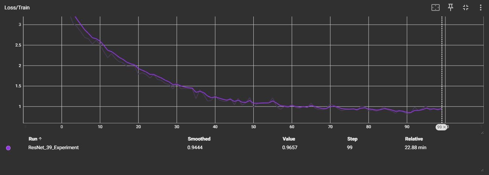

# Environmental Sound Classification Using Residual Convolutional Neural Networks and Bidirectional Pseudo-Inverse Learning


## Objective

To design and implement an end-to-end deep learning system that classifies environmental sounds (such as sirens, rain, engines, and animal sounds) from raw audio signals by combining signal processing techniques with a Residual Convolutional Neural Network (ResNet), and mathematically comparing it against a gradient-free Bidirectional Pseudo-Inverse Learning (BiPIL) scheme.

---

## Motivation / Why the Project is Interesting

Environmental audio classification plays a key role in smart cities, surveillance systems, assistive technologies, and edge AI devices. Audio signals are non-stationary and unstructured, making them mathematically challenging to model. This project is interesting because it integrates Fourier analysis and linear algebra with modern deep learning techniques, adapts image-based CNN architectures for audio data, and contrasts iterative optimization (gradient descent) with analytical closed-form learning (Moore-Penrose pseudo-inverse).

---

## 1. Introduction

Environmental Sound Classification (ESC) focuses on identifying non-speech audio events occurring in everyday environments. Unlike speech recognition, environmental sounds are highly diverse, irregular, and often contaminated by background noise, making classification a challenging task.

ESC systems are widely applied in:
* Smart city monitoring
* Urban surveillance systems
* Assistive healthcare devices
* Context-aware human–computer interaction

Recent advances in deep learning have significantly improved audio recognition performance. Convolutional Neural Networks (CNNs), particularly residual architectures introduced in [1], enable deeper networks through shortcut connections that mitigate vanishing gradient issues. However, increasing model depth raises computational complexity and may lead to overfitting, especially for small-scale datasets.

Alternatively, gradient-free learning approaches such as BiPIL [3] eliminate backpropagation and iterative gradient updates. These methods reduce hyperparameter tuning complexity and offer architectural flexibility, making them promising for moderate-sized datasets.

In this work, we conduct a comparative study between a Residual CNN architecture and a BiPIL-based multilayer neural network using the ESC-50 dataset. The objective is to analyze performance trade-offs in terms of classification accuracy, training efficiency, and architectural scalability.

---

## 2. Dataset Description

### 2.1 ESC-50 Dataset

The experiments in this work utilize the ESC-50 dataset [2], a widely used benchmark dataset for environmental sound classification.

**Table 1: ESC-50 Dataset Characteristics**
| Property | Value |
| :--- | :--- |
| Total audio clips | 2000 |
| Number of classes | 50 |
| Samples per class | 40 |
| Audio duration | 5 seconds |
| Sampling rate | 44.1 kHz |
| Audio format | WAV |

Each sound clip belongs to one of fifty environmental sound categories grouped into five major semantic classes.

**Table 2: ESC-50 Category Groups**
| Category Group | Examples |
| :--- | :--- |
| Animals | Dog bark, rooster, frog |
| Natural soundscapes | Rain, sea waves, wind |
| Human non-speech | Coughing, sneezing, clapping |
| Interior sounds | Door knock, washing machine |
| Urban noises | Car horn, siren, engine |

The ESC-50 dataset is balanced, containing an equal number of samples for each class. However, due to its relatively small size compared to large-scale datasets, it poses challenges for training deep neural networks and is therefore well suited for evaluating both deep learning models and alternative learning strategies.

---

## 3. Methodology

### 3.1 System Overview
The proposed framework compares two fundamentally different learning paradigms for classifying environmental audio from the ESC-50 dataset:
1. **A gradient-based Convolutional Neural Network (CNN)**, starting from foundational from-scratch implementations and scaling up to deep Residual Networks (ResNets).
2. **A gradient-free Bidirectional Pseudo-Inverse Learning (BiPIL) network**, which encompasses both forward and backward training processes using analytical matrix operations.

Both models operate on 2D Mel-spectrogram representations extracted from raw audio signals. The pipeline follows a structured progression:


*Figure 1: Overview*

### 3.2 CNN and ResNet

#### 3.2.1 Spectrogram-Based Audio Representation
Audio signals are originally one–dimensional waveforms representing amplitude over time. However, convolutional neural networks perform better when the input is represented as a two–dimensional structure similar to an image. Therefore, the audio waveform is converted into a spectrogram, which represents how the frequency content of a signal changes over time.

A spectrogram is generated using the Short-Time Fourier Transform (STFT). The STFT divides the signal into small overlapping frames and computes the Fourier Transform for each frame. This allows the system to observe time-varying frequency patterns in environmental sounds.

The STFT is mathematically expressed as:

$$X(k,m) = \sum_{n=0}^{N-1} x[n]w[n-m]e^{-j2\pi kn/N}$$

where:
* $x[n]$ – discrete audio signal
* $w[n]$ – window function applied to each frame
* $N$ – number of samples in each window
* $k$ – frequency bin index
* $m$ – time frame index

The result of the STFT is a matrix representing frequency intensity at different time steps. Each column corresponds to a time frame and each row corresponds to a frequency component.

To better represent how humans perceive sound, the frequency axis is converted to the Mel scale using a Mel filter bank. This transformation emphasizes lower frequencies which are more important for human auditory perception.

$$Mel(f) = 2595 \log_{10}\left(1 + \frac{f}{700}\right)$$


*Figure 2: Example of a Mel Spectrogram generated from an environmental sound signal. The horizontal axis represents time, the vertical axis represents frequency on the Mel scale, and the color intensity indicates the energy of each frequency component.*

The final output is a Mel spectrogram, which is treated as a two–dimensional image and used as input to the convolutional neural network for environmental sound classification.

#### 3.2.2 Foundations of Neural Networks
Before building complex architectures, it is critical to establish the mathematical foundations of Artificial Neural Networks (ANNs).


*Figure 3: The foundational building block of a neural network: a single neuron calculating a weighted sum and applying an activation function.*

At its core, a neural network layer performs a linear transformation followed by a non-linear activation. For a given input vector $x \in \mathbb{R}^n$:

$$z = Wx + b$$
$$a = \phi(z)$$

Where $W$ represents the learnable weight matrix, $b$ represents the bias vector, and $\phi(\cdot)$ is a non-linear activation function (such as ReLU). During training, the network makes predictions, calculates the error using a loss function, and updates the weights by propagating the error backwards using the chain rule of calculus.

#### 3.2.3 Convolutional Neural Networks (CNN) from Scratch
While standard neural networks flatten inputs into 1D vectors, Convolutional Neural Networks (CNNs) preserve the 2D spatial relationships of spectrograms. Building a CNN from scratch requires defining the forward and backward passes mathematically.

Instead of full matrix multiplication, a CNN slides small, learnable filters (kernels) across the input to extract localized acoustic features. For an input feature map $X$ and a kernel $K$, the output $Y$ is computed as:

$$Y(i,j) = \sum_m \sum_n X(i-m,j-n)K(m,n)$$


*Figure 4: Hierarchical feature extraction through multiple Conv2D layers, moving from simple edges to complex higher-order features before classification.*

Building this involves implementing specific layers:
* **Convolutional Layer:** Performs the sliding dot product. During backpropagation, gradients are calculated using a convolution between the input and the upstream gradient.
* **Activation Layer:** Applies a non-linearity (e.g., ReLU) to the feature map.
* **Pooling Layer:** Downsamples the feature maps to reduce dimensionality.
* **Fully Connected Layer:** Flattens the pooled maps to output final class probabilities.

#### 3.2.4 Deep Residual Networks (ResNet)
As neural networks become deeper, they often encounter training difficulties. One major issue is the **degradation problem**, where increasing the number of layers leads to higher training error and reduced accuracy instead of improving performance. This issue is not caused by overfitting but rather by optimization challenges that make deep networks harder to train [1].

To address this limitation, the **Deep Residual Learning** framework introduces shortcut connections that allow the network to learn residual mappings instead of directly learning the desired underlying function. In this approach, the stacked convolutional layers focus on learning only the difference between the input and the desired output.

**Numerical Toy Example (Vanishing Gradient vs. ResNet):**
In a plain CNN, the output after one block is $H(x) = Wx$. During backpropagation, the gradient becomes: $\frac{\partial L}{\partial x} = \frac{\partial L}{\partial H} \cdot W$.
If Weight $W = 0.1$ and Input $x = 1$:
* Plain CNN output after 5 layers: $0.1^5 = 0.00001$ (gradient nearly vanishes).
* Residual CNN output after 5 layers: $1 + 5 \times 0.1 \approx 1.5$ (signal preserved).


*Figure 5: A detailed look at a Residual Block, highlighting the feature extraction layers and the crucial identity shortcut connection.*

In a residual block, the input is passed through a sequence of convolutional layers that perform feature extraction. At the same time, the original input is directly forwarded to the output through an identity shortcut connection. The final output of the block is obtained by adding the shortcut input to the output of the convolutional layers.

Let the desired mapping between input and output be denoted as $\mathcal{H}(x)$. Instead of learning this mapping directly, the residual learning approach allows the network to learn a residual function defined as:
$$\mathcal{F}(x) = \mathcal{H}(x) - x$$

The final output of the residual block can then be written as:
$$y = \mathcal{F}(x,\{W_i\}) + x$$

Here, $x$ represents the input to the residual block, $\mathcal{F}(x)$ represents the transformation learned by the stacked convolutional layers, and $y$ is the final output obtained after combining the residual output with the shortcut connection. This structure allows gradients to flow more effectively through the network during backpropagation, enabling stable training of very deep architectures.

**Table 3: Comparison of Different ResNet Architectures (GPU)**
| Model | Layers | Channels | Epochs | Acc (GPU) | Time (GPU) |
| :--- | :--- | :--- | :--- | :--- | :--- |
| ResNet-26 | 26 | [64,128,256,512] | 100 | 83% | 20.8 minutes |
| ResNet-34 | 34 | [64,128,256,512] | 100 | 84.25% | 20 minutes |
| ResNet-39 | 39 | [64,128,256,512] | 100 | 83% | 23 minutes |

**Table 4: Performance Comparison of Different ResNet Architectures without GPU**
| ResNet Layers | Channels | Epochs | Accuracy (%) | Time / Epoch |
| :--- | :--- | :--- | :--- | :--- |
| ResNet-34 (3-4-6-3) | 64-128-256-512 | 40 | 67.25 | 4.38 min |
| | 32-48-72-108 | 40 | 68.25 | 45 sec |
| | 32-64-128-64 | 40 | 66.25 | 1.09 min |
| | 32-64-96-128 | 40 | 67.00 | 1.01 min |
| ResNet-39 (3-4-6-3-1) | 64-128-256-512-50 | 40 | 66.25 | 4.08 min |
| | 32-48-64-96-128 | 40 | 63.00 | 2.35 min |
| | 32-48-72-108-162 | 40 | 66.75 | 1.59 min |
| | 32-64-96-128 | 40 | 67.75 | 1.23 min |
| ResNet-26 (2-3-4-2) | 32-64-96-128 | 40 | 67.75 | 1.23 min |
| | 32-48-72-108 | 40 | 63.25 | 41 sec |
| | 32-64-128-64 | 40 | 66.00 | 33 sec |

### 3.3 Bidirectional Pseudo-Inverse

#### 3.3.1 Network Structure

*Figure 6: Matrix dimensional flow of the BiPIL architecture*

Figure 6 illustrates the matrix dimensional flow of the implemented BiPIL architecture. The network processes all training samples simultaneously in matrix form. A typical implementation of this subnetwork includes:
* Input: 2048-dimensional vector (extracted features)
* Hidden Layer 1: 25 neurons
* Hidden Layer 2: 50 neurons
* Output Layer: 50 neurons (ESC-50 classes)

We define a non-linear activation function $\phi(x)$ and its corresponding inverse $\phi^{-1}(x)$. For analytical purposes, if $\phi(x) = \cos(x)$, the inverse is computed as $\phi^{-1}(x) = \arccos(x)$.

#### 3.3.2 Forward Phase
A multilayer network is dynamically constructed using autoencoders trained in an unsupervised manner on data reconstruction tasks. Given an input $X$, the hidden representations are mapped sequentially:
$$H_1 = \phi(W_1 X)$$
$$H_2 = \phi(W_2 H_1)$$

The optimal output weights $W_o$ to map to the target $Y$ can be approximated analytically using the Moore-Penrose inverse:
$$W_o = Y H_2^{+}$$

#### 3.3.3 Backward Reconstruction
Because the forward process relies on unsupervised data reconstruction, it fails to fully utilize the information in the target labels. The backward training process serves as a supervised fine-tuning step, propagating label information backward through the network to analytically update the connection weights. The hidden representations are refined using inverse activations:
$$H_2^{b} = W_o^{+} Y$$
$$H_1^{b} = W_2^{+} \phi^{-1}(H_2^{b})$$

Finally, the forward weights are recomputed to align with these refined representations:
$$W_1 = H_1^{b} X^{+}$$

This bidirectional learning results in a neural network comprising two twin subnetworks. The features extracted from both subnetworks are fused together and used as inputs for downstream classification tasks on the ESC-50 dataset.

---

## 4. Results and Discussion

### 4.1 Effect of Hyperparameters on Model Accuracy
To analyze how different hyperparameters influence model performance, experiments were conducted by varying one parameter at a time while keeping the others fixed. The results are summarized in the following tables.

**Table 5: Effect of Hidden Layer Architecture on Model Accuracy**
| Hidden Layer Architecture | Train Accuracy | Test Accuracy | Time took for training |
| :--- | :--- | :--- | :--- |
| (50, 25) | 60.00% | 30.00% | 4.00 secs |
| (25, 50) | 100.00% | 50.00% | 2.20 secs |
| (250, 250) | 100.00% | 50.00% | 2.97 secs |
| (1000, 500) | 100.00% | 50.00% | 3.94 secs |
| (500, 1000) | 100.00% | 50.00% | 4.04 secs |
| (25, 50, 50) | 44.00% | 22.00% | 6.15 secs |
| (50, 100, 50) | 100.00% | 50.00% | 2.57 secs |
| (100, 50, 100) | 100.00% | 50.00% | 2.45 secs |
| (1000, 100, 100) | 12.00% | 6.00% | 8.43 secs |
| (100, 1000, 100) | 100.00% | 50.00% | 3.63 secs |
| (200, 500, 1000) | 100.00% | 50.00% | 4.48 secs |

**Table 6: Effect of Activation Functions on Model Accuracy**
| Activation Function | Train Accuracy | Test Accuracy | Time took for training |
| :--- | :--- | :--- | :--- |
| Sigmoid | 100.00% | 50.00% | 2.58 secs |
| Tanh | 100.00% | 50.00% | 2.66 secs |
| Cos | 100.00% | 50.00% | 2.20 secs |

**Table 7: Effect of Train-Test Split Ratio on Model Accuracy**
| Train-Test Split | Train Accuracy | Test Accuracy | Time took for training |
| :--- | :--- | :--- | :--- |
| 40:60 | 14.00% | 2.42% | 1.72 secs |
| 50:50 | 100.00% | 50.00% | 2.20 secs |
| 70:30 | 30.00% | 3.17% | 7.06 secs |
| 80:20 | 22.00% | 2.00% | 12.80 secs |

### 4.2 Training and Validation Performance
The performance of the proposed models was evaluated using training loss and validation accuracy curves. These graphs illustrate the learning behaviour of each ResNet architecture during training.


*Figure 7: Validation accuracy curve for ResNet-26 during training.*


*Figure 8: Training loss curve for ResNet-26 showing convergence across epochs.*


*Figure 9: Validation accuracy curve for ResNet-34 during training.*


*Figure 10: Training loss curve for ResNet-34 showing gradual reduction across epochs.*


*Figure 11: Validation accuracy curve for the proposed ResNet-39 architecture.*


*Figure 12: Training loss curve for the proposed ResNet-39 architecture.*

Preliminary analysis indicates that CNN models demonstrate strong hierarchical feature learning capable of identifying complex acoustic patterns, while BiPIL offers rapid analytical training that significantly reduces hyperparameter tuning time.

**Table 8: Model Performance Comparison**
| Model | Training Accuracy |
| :--- | :--- |
| ResNet-34 | 84.25% |
| ResNet-39 | 83.00% |
| ResNet-26 | 83.00% |
| BiPIL | 100% |

---

## 5. Computational Complexity Analysis

The computational cost of the proposed system mainly arises from the convolutional operations in the CNN and the pseudo-inverse computation used in the BiPIL training algorithm. Table 9 summarizes the complexity comparison.

**Table 9: Computational Complexity Comparison**
| Method | Operation | Time Complexity |
| :--- | :--- | :--- |
| CNN Layer | Convolution operation | $O(N \cdot k^2 \cdot C_{in} \cdot C_{out})$ |
| BiPIL Training | Pseudo-inverse matrix computation | $O(n^3)$ |

where:
* $N$ represents the spatial dimension of the feature map
* $k$ represents the convolution kernel size
* $C_{in}$ represents the number of input channels
* $C_{out}$ represents the number of output channels
* $n$ represents the dimensionality of the matrix used in the pseudo-inverse computation

From Table 9, it can be observed that convolution operations scale with the feature map size and channel dimensions, while the BiPIL algorithm involves cubic complexity due to matrix inversion. Although BiPIL eliminates iterative backpropagation and multiple training epochs, the pseudo-inverse computation may become computationally expensive for large matrices.

---

## 6. Toy Example of BiPIL Learning

Consider a simplified dataset with:
* Input dimension = 2
* One hidden layer with 2 neurons
* Output dimension = 1

Let the training input matrix be:
$$X = \begin{bmatrix} 1 & 0 \\ 0 & 1 \end{bmatrix}$$

and the target output be:
$$Y = \begin{bmatrix} 1 & 0 \end{bmatrix}$$

Assume a random weight matrix $W_1$:
$$W_1 = \begin{bmatrix} 0.5 & -0.3 \\ 0.2 & 0.7 \end{bmatrix}$$

The hidden representation becomes:
$$H = \phi(W_1 X)$$

The output weight is computed analytically as:
$$W_o = Y H^{+}$$

where $H^{+}$ is the Moore–Penrose pseudoinverse.

Unlike gradient descent, no iterative updates are required. The solution is obtained in closed form using matrix operations.

---

## 7. Summary

The proposed methodology integrates perceptually meaningful feature extraction, structured residual learning, strong data augmentation, and modern optimization strategies. This combination ensures stable training and improved generalization performance on the ESC-50 environmental sound classification task.

---

## 8. Future Plans

* Real-time environmental sound classification using streaming microphone input.
* Edge deployment through INT8 quantization for low-power devices such as Raspberry Pi.
* Performance comparison with Audio Spectrogram Transformers (AST).
* Deployment in smart city noise monitoring and emergency detection systems.

---

## 9. References

1. K. He, X. Zhang, S. Ren, and J. Sun, "Deep Residual Learning for Image Recognition," CVPR, 2016.
2. K. J. Piczak, "ESC: Dataset for Environmental Sound Classification," ACM Multimedia, 2015.
3. H. Liu et al., "BiPIL: Bidirectional Gradient-Free Learning Scheme for Multilayer Neural Networks," IEEE Transactions.

---

## 10. Content and Folder Structure

```bash
├── code/
|   ├── audio-cnn-visualisation/
|       └── src/app/              
│   ├── main.py            
│   ├── model.py            
│   ├── requirements.txt
|   ├── train.py            
│
├── Doc/                   
│   ├── MCF4_0th_review.pdf
│   ├── MFC4_1st_review.pdf
│   ├── Mfc_report_final_D10.pdf
│   ├── base paper.pdf
│   ├── theory.excalidraw
│ 
└── README.md
